# Contributing to Cove JS SDK

## Getting Started

### Prerequisites
- Node.js v20.x or later
- pnpm v9.x or later

### Initial Setup
```bash
# Clone the repository
git clone https://github.com/your-org/cove-js-sdk.git
cd cove-js-sdk

# Install dependencies
pnpm install

# Build all packages
pnpm build

# Run tests to verify setup
pnpm test
```

## Development Workflow

### Branch Structure
- `develop`: Integration branch for new features and fixes
- `main`: Production-ready releases only

### Workflow Overview

```mermaid
flowchart TD
    Start([Developer starts work]) --> Branch[Create feature branch from develop]
    Branch --> Code[Write code]
    Code --> Changeset[Add changeset: pnpm changeset]
    Changeset --> Commit[Commit code + changeset]
    Commit --> Push[Push to feature branch]
    Push --> PR1[Create PR to develop]
    PR1 --> Review{Code Review}
    Review -->|Approved| Merge1[Merge to develop]
    Review -->|Changes needed| Code
    
    Merge1 --> Accumulate[Changesets accumulate in develop]
    Accumulate --> Ready{Ready to release?}
    Ready -->|No| Start
    Ready -->|Yes| Auto[🤖 GitHub Actions triggered on develop]
    
    Auto --> VersionPR[Auto-creates Release PR: develop → main]
    VersionPR --> Contains[Release PR contains:<br/>• Version bumps<br/>• CHANGELOG updates<br/>• Removed changesets]
    Contains --> Review2{Review Release PR}
    Review2 -->|Not ready| Close[Close PR & continue development]
    Close --> Start
    Review2 -->|Approved| Merge2[Merge to main]
    
    Merge2 --> Publish[🤖 GitHub Actions triggered on main]
    Publish --> Build[Build packages]
    Build --> NPM[Publish to npm]
    NPM --> Tags[Create git tags]
    Tags --> End([Release complete!])
    
    style Auto fill:#e1f5fe
    style Publish fill:#e1f5fe
    style VersionPR fill:#fff3e0
    style Contains fill:#fff3e0
    style NPM fill:#c8e6c9
    style Tags fill:#c8e6c9
```



### Step-by-Step Guide

1. **Create a feature branch from develop:**
   ```bash
   git checkout develop
   git pull origin develop
   git checkout -b feat/your-feature-name
   ```

2. **Make your changes and test:**
   ```bash
   pnpm dev        # Start development mode
   pnpm test       # Run tests
   pnpm check      # Run type checking and linting
   ```

3. **Add a changeset:**
   ```bash
   pnpm changeset
   ```
   - Select the packages you've changed
   - Choose the version bump type (major/minor/patch)
   - Write a meaningful description for the changelog

4. **Commit your changes:**
   ```bash
   git add .
   git commit -m "feat: your feature description"
   ```
   
   Follow [Conventional Commits](https://www.conventionalcommits.org/):
   - `feat:` New feature
   - `fix:` Bug fix
   - `docs:` Documentation changes
   - `chore:` Maintenance tasks
   - `refactor:` Code refactoring
   - `test:` Test updates

5. **Push and create a PR:**
   ```bash
   git push origin feat/your-feature-name
   ```
   Then open a PR from your branch to `develop`.

## Pull Request Guidelines

### PR Checklist
When creating a pull request, ensure:

- [ ] Added a changeset (run `pnpm changeset` if this PR contains user-facing changes)
- [ ] Updated documentation (if applicable)
- [ ] Added/updated tests
- [ ] All tests pass (`pnpm test`)
- [ ] Code follows style guidelines (`pnpm lint`)
- [ ] Self-reviewed the code

### PR Description Template
```markdown
## Description
Brief description of changes

## Type of Change
- [ ] Bug fix (non-breaking change)
- [ ] New feature (non-breaking change)
- [ ] Breaking change
- [ ] Documentation update

## Related Issues
Fixes #(issue number)

## Additional Notes
Any additional context
```

## Release Process

### Automated Release Flow

**How it works:**

1. **Development Phase:**
   - Developers merge features with changesets into `develop`
   - Changesets accumulate until ready for release

2. **Release PR (Automated):**
   - GitHub Actions monitors `develop` for changesets
   - Automatically creates/updates a "Release PR" from `develop` to `main`
   - This PR contains:
     - Version bumps in package.json files
     - Updated CHANGELOG.md files
     - Removal of consumed changeset files
   - The PR stays open and updates as more changesets are added to `develop`

3. **Release Decision:**
   - When ready to release, review and merge the Release PR to `main`
   - This single action triggers the entire release

4. **Publishing (Automated):**
   - Merging to `main` triggers GitHub Actions to:
     - Build all packages
     - Publish to npm registry
     - Create git tags for the versions

**Key Points:**
- Version bumps ONLY happen in the Release PR (develop → main)
- No manual PR creation needed for releases
- `develop` never contains version bump commits
- Clean, linear history with no divergence

## Repository Setup

### GitHub Configuration

1. **Create `develop` branch:**
   ```bash
   git checkout -b develop
   git push -u origin develop
   ```

2. **Set branch protection rules** (Settings → Branches):
   
   For `main`:
   - ✅ Require pull request reviews
   - ✅ Dismiss stale pull request approvals
   - ✅ Require branches to be up to date
   - ✅ Include administrators
   
   For `develop`:
   - ✅ Require pull request reviews
   - ✅ Require branches to be up to date

3. **Add repository secrets** (Settings → Secrets and variables → Actions):
   - `NPM_TOKEN`: Your npm authentication token (see npm setup below)

### npm Registry Setup

1. **Create npm account** (if needed):
   - Sign up at https://www.npmjs.com/signup

2. **Generate automation token:**
   ```bash
   npm login
   npm token create --type=automation
   ```

3. **Add token to GitHub:**
   - Copy the generated token
   - Add as `NPM_TOKEN` secret in GitHub repository settings

4. **Verify package names are available:**
   ```bash
   npm view @cove/react-sdk  # Should return 404 if available
   ```

## Available Commands

### Development
```bash
pnpm dev          # Start dev mode for all packages
pnpm build        # Build all packages
pnpm test         # Run tests
pnpm test:watch   # Run tests in watch mode
```

### Code Quality
```bash
pnpm lint         # Check code style
pnpm lint:fix     # Fix code style issues
pnpm typecheck    # Check TypeScript types
pnpm check        # Run all checks
pnpm check:fix    # Fix all auto-fixable issues
```

### Changesets & Release
```bash
pnpm changeset    # Add a changeset
pnpm version      # Version packages (CI only)
pnpm release      # Build and publish (CI only)
```

### Maintenance
```bash
pnpm clean        # Clean build artifacts
pnpm audit        # Check for vulnerabilities
```

## Project Structure

```
cove-js-sdk/
├── packages/
│   ├── types/        # (Private) TypeScript type definitions
│   ├── utils/        # (Private) Utility functions
│   └── react-sdk/    # (Public) React components and hooks
├── .changeset/       # Changeset configuration
├── .github/
│   └── workflows/    # GitHub Actions workflows
├── biome.json        # Code formatting and linting
├── tsconfig.json     # TypeScript configuration
└── vitest.config.ts  # Test configuration
```

## Need Help?

- Check existing issues: [GitHub Issues](https://github.com/your-org/cove-js-sdk/issues)
- Read the documentation: [README](./README.md)
- Ask questions in discussions: [GitHub Discussions](https://github.com/your-org/cove-js-sdk/discussions)