# Contributing to Cove JS SDK

## Pull Request Guidelines

When creating a pull request, please ensure:

### PR Description
- Provide a clear description of the changes
- Link any related issues using `#issue-number`
- Mark the type of change:
  - Bug fix (non-breaking change which fixes an issue)
  - New feature (non-breaking change which adds functionality)
  - Breaking change (fix or feature that would cause existing functionality to not work as expected)
  - Documentation update

### PR Checklist
- [ ] Added a changeset (run `pnpm changeset` if this PR contains user-facing changes)
- [ ] Updated documentation (if applicable)
- [ ] Added/updated tests
- [ ] All tests pass (`pnpm test`)
- [ ] Code follows style guidelines (`pnpm lint`)
- [ ] Self-reviewed the code

## Development Workflow

We use a Git flow with two main branches:
- `develop`: Integration branch for new features and fixes
- `main`: Production-ready releases only

### Complete Workflow Diagram

```mermaid
flowchart TD
    Start([Developer starts work]) --> Branch[Create feature branch from develop]
    Branch --> Code[Write code]
    Code --> Changeset[Add changeset: pnpm changeset]
    Changeset --> Commit[Commit code + changeset]
    Commit --> Push[Push to feature branch]
    Push --> PR1[Create PR to develop]
    PR1 --> Review{Code Review}
    Review -->|Approved| Merge1[Merge to develop]
    Review -->|Changes needed| Code
    
    Merge1 --> Auto[🤖 GitHub Actions triggered]
    Auto --> VersionPR[Auto-creates Version PR]
    VersionPR --> Contains[Version PR contains:<br/>• Version bumps<br/>• CHANGELOG updates<br/>• Removed changesets]
    Contains --> Review2{Review Version PR}
    Review2 -->|Approved| Merge2[Merge back to develop]
    
    Merge2 --> Ready{Ready to release?}
    Ready -->|No| Start
    Ready -->|Yes| ReleasePR[Create PR: develop → main]
    ReleasePR --> Review3{Final Review}
    Review3 -->|Approved| Merge3[Merge to main]
    
    Merge3 --> Publish[🤖 GitHub Actions triggered]
    Publish --> Build[Build packages]
    Build --> NPM[Publish to npm]
    NPM --> Tags[Create git tags]
    Tags --> End([Release complete!])
    
    style Auto fill:#e1f5fe
    style Publish fill:#e1f5fe
    style VersionPR fill:#fff3e0
    style Contains fill:#fff3e0
    style NPM fill:#c8e6c9
    style Tags fill:#c8e6c9
```



### Making Changes

1. **Create a feature branch from develop:**
   ```bash
   git checkout develop
   git pull origin develop
   git checkout -b feat/your-feature-name
   ```

2. **Make your changes and test:**
   ```bash
   pnpm dev        # Start development mode
   pnpm test       # Run tests
   pnpm check      # Run type checking and linting
   ```

3. **Add a changeset:**
   ```bash
   pnpm changeset
   ```
   - Select the packages you've changed
   - Choose the version bump type (major/minor/patch)
   - Write a meaningful description for the changelog

4. **Commit your changes:**
   ```bash
   git add .
   git commit -m "feat: your feature description"
   ```
   
   Follow [Conventional Commits](https://www.conventionalcommits.org/):
   - `feat:` New feature
   - `fix:` Bug fix
   - `docs:` Documentation changes
   - `chore:` Maintenance tasks
   - `refactor:` Code refactoring
   - `test:` Test updates

5. **Push and create a PR:**
   ```bash
   git push origin feat/your-feature-name
   ```
   Then open a PR from your branch to `develop`.

### Release Process

Releases follow a two-stage automated process to prevent branch divergence:

**Stage 1: Version PR (develop branch)**
- When changesets are pushed to `develop`, GitHub Actions automatically creates a "Version PR"
- This PR contains version bumps and CHANGELOG updates
- Review and merge this PR back into `develop`

**Stage 2: Publish (main branch)**
- Create a PR from `develop` to `main` with all changes including versions
- When merged to `main`, GitHub Actions automatically:
  - Builds all packages
  - Publishes to npm
  - Creates git tags

This ensures `develop` and `main` stay in sync with no divergent commits.

### Commands

```bash
# Development
pnpm dev          # Start dev mode for all packages
pnpm build        # Build all packages
pnpm test         # Run tests
pnpm test:watch   # Run tests in watch mode

# Code Quality
pnpm lint         # Check code style
pnpm lint:fix     # Fix code style issues
pnpm typecheck    # Check TypeScript types
pnpm check        # Run all checks
pnpm check:fix    # Fix all auto-fixable issues

# Changesets
pnpm changeset    # Add a changeset
pnpm version      # Version packages (CI only)
pnpm release      # Build and publish (CI only)

# Maintenance
pnpm clean        # Clean build artifacts
pnpm audit        # Check for vulnerabilities
```