# Contributing to Cove JS SDK

## Quick Start

```bash
# Setup
git clone https://github.com/your-org/cove-js-sdk.git
cd cove-js-sdk
pnpm install
pnpm build

# Development
pnpm dev          # Start dev mode
pnpm test         # Run tests
pnpm check        # Type check + lint
pnpm changeset    # Add changeset for your changes
```

## Development Workflow

### 1. Branch Strategy
- **develop** → Feature integration
- **main** → Production releases only

### 2. Making Changes
```bash
# Start from develop
git checkout develop && git pull
git checkout -b feat/your-feature

# Make changes, then add changeset
pnpm changeset  # Select packages, version bump, write changelog

# Commit (auto-runs format, lint, type check, tests)
git add . && git commit -m "feat: your description"

# Push and create PR to develop
git push origin feat/your-feature
```

### 3. Commit Convention
- `feat:` New feature
- `fix:` Bug fix  
- `docs:` Documentation
- `chore:` Maintenance
- `test:` Test updates

## Release Process (Fully Automated)

```mermaid
flowchart LR
    A[Feature PRs → develop] --> B[Changesets accumulate]
    B --> C[🤖 Auto-creates Release PR]
    C --> D[You: Merge Release PR to main]
    D --> E[🤖 Publishes to npm]
    E --> F[🤖 Syncs main → develop]
```



### How It Works
1. **Develop Phase**: Merge features with changesets to `develop`
2. **Release PR**: Auto-created from `develop` → `main` with version bumps
3. **Publish**: Merge Release PR triggers npm publish with Provenance
4. **Sync**: `main` auto-merges back to `develop`

## Commands Reference

```bash
# Development
pnpm dev          # Start dev mode
pnpm build        # Build packages
pnpm test         # Run tests
pnpm test:watch   # Watch mode

# Quality
pnpm lint         # Check style
pnpm lint:fix     # Fix style
pnpm typecheck    # Check types
pnpm check        # All checks
pnpm check:fix    # Fix all

# Release
pnpm changeset    # Add changeset
pnpm clean        # Clean build
pnpm audit        # Security check
```

## Project Structure

```
packages/
├── types/        # Private - TypeScript types
├── utils/        # Private - Utilities  
└── react-sdk/    # Public - React SDK
.changeset/       # Config (baseBranch: "main")
.github/workflows/release.yml  # CI/CD
```

## Setup Requirements

### GitHub Settings
1. Enable **"Allow GitHub Actions to create and approve pull requests"**
   - Settings → Actions → General → Workflow permissions
2. Create `develop` branch
3. Set branch protection for `main` and `develop`

### npm Setup
- Uses OIDC authentication (no tokens needed!)
- Public packages need:
```json
{
  "publishConfig": {
    "access": "public",
    "provenance": true
  }
}
```

## Pre-commit Hooks
Automatically runs on commit:
- Format (Biome)
- Lint (Biome)
- Type check (TypeScript)
- Related tests (Vitest)

Bypass if needed: `git commit --no-verify -m "emergency"`

## Key Configuration

| Config | Value | Purpose |
|--------|-------|---------|
| `baseBranch` | `"main"` | Release PRs target main |
| `branch` param | `main` | In changeset action |
| Package type | `"module"` | ESM support |
| npm auth | OIDC | No tokens needed |

## Help

- Issues: [GitHub Issues](https://github.com/your-org/cove-js-sdk/issues)
- Docs: [README](./README.md)